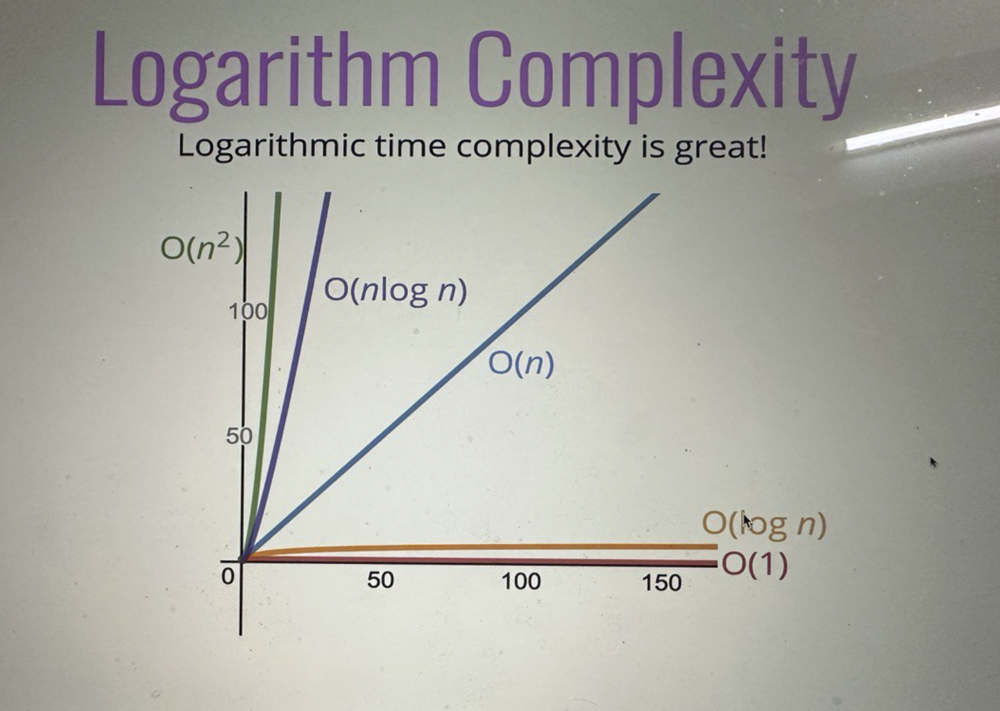

# Actual Usage of BigO.

- It's a term in Computer programming which will define how much faster/capable your solution is, if you have multiple solutions to a single problem.
- Let's say you can solve string reverse problem in 10 different ways or you can sort a array with 10 different ways but **which one is superior than other** such kind of questions can be answered by giving BigO's of those 10 solutions.

## Addition of numbers till nth natural number.

```
Solution 1

const solution1 = (n)=>{
    let sum = 0;
    for(let i = 0; i<=n; i++){
        sum = sum + i;
    };

    console.log('addtion is: ', sum);
}

solution1(6);-------- output>> addition is: 21
```

```
Solution 2

const solution2 = (n)=>{
    let sum = 0;
    sum = (n * (n+1))/2;

    console.log('addtion is: ', sum);
}

solution1(6);-------- output>> addition is: 21
```

- Which one is better from above two solutions? **What does better actually mean?**

  - Does it mean faster?

    - This is the number one priority while you compare two different solutions.
    - Same machine can give you different output on how much faster the code is.

    ```
      const solution1 = (n)=>{
          let sum = 0;
          for(let i = 0; i<=n; i++){
              sum = sum + i;
          };

      }
      const time1 = performance.now();
      solution1(10000000000);
      const time2 = performance.now();
      console.log('Exection time in loop: ', time2 - time1);-------- output>> exection time in loop:  14356
    ```

    ```
    const solution2 = (n)=>{
        let sum = 0;
        sum = (n * (n+1))/2;

    }

    const time1 = performance.now();
    solution2(10000000000);
    const time2 = performance.now();
    console.log('Execution time in formula: ', time2 - time1);-------- output>> Formula execution time:  0
    ```

    - Clearly we can see that solution2 function is **Faster**. But the problem is when you execute this function you will get multiple time outputs. So we can not say that always we are going to use **performance.now()** method to check wether the code is Faster or not so instead of time we will be using **BigO** which will specify which solution is faster.
    - So instead of checking time we can just check **number of operations computer has to perform.** Number of operations will remain constant no matter which computer I'm using.
    - We have **three** operations in below solution multiplication, addition and division. Here **time** remains constant when the number increases.

      ```
      const solution2 = (n)=>{
          let sum = 0;
          sum = (n * (n+1))/2;

      }
      ```

    - We have comparision, increment, addition operation and this is **happening n times.** Here **time** increases when the number increases.

      ```
      const solution1 = (n)=>{
          let sum = 0;
          for(let i = 0; i<=n; i++){
              sum = sum + i;
          };

      }
      ```

  - How much memory it used? number of variable created.
  - More readable?

## BigO notation.

- As we seen above how time and input relation is important to understan which **solution/function** will take less amount of time to give us results. In normal programming we will not be dealing with actual timing's we will use **BigO** to check which solution is faster. **BigO** is the way of defining relationship of **number inputs** given to a solution and **time required** to get the output from it.
- So we can say Algorithm is **O(f(n))** which specifies as n increases what is the behaviour of function.

  - linear: (f(n) = n).
  - quadratic: (f(n) = n^2).
  - constant: (f(n) = 1).
  - miscellaneous: This could be anything logn, etc..

  ```
  The time complexity is O(f(n)). And f(n) = 1 which is constant.
    const solution2 = (n)=>{
        let sum = 0;
        sum = (n * (n+1))/2;

    }
  ```

  ```
  The time complexity is O(f(n)). And f(n) = n which is not constant which specifies as n increases the output also increases. That specifies that this function is not constant this is a linear one.
    const solution1 = (n)=>{
        let sum = 0;
        for(let i = 0; i<=n; i++){
            sum = sum + i;
        };

    }
  ```

- ## Rules in BigO

  - Constants does not matters much. 2n boils down to n. O(2n)---> O(n).
  - O(500)---> O(1).
  - O(12n^2)---> O(n^2).

- **Space Complexity**
  - We are only concerned about what is happening inside the algorithm not with the input space, this is usually called as **auxiliry space complexity.**
  - Booleans, numbers, undefined, nulls takes constant space.
  - String requires O(n) space, the length of string increases **space** required to fill that string also increases.
  - Reference types in javascript takes O(n) space, n is the number of elements in array or keys in object
- ## Curves
  - 
